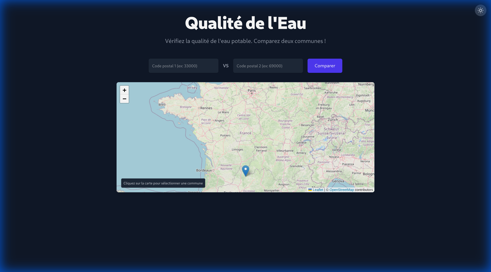
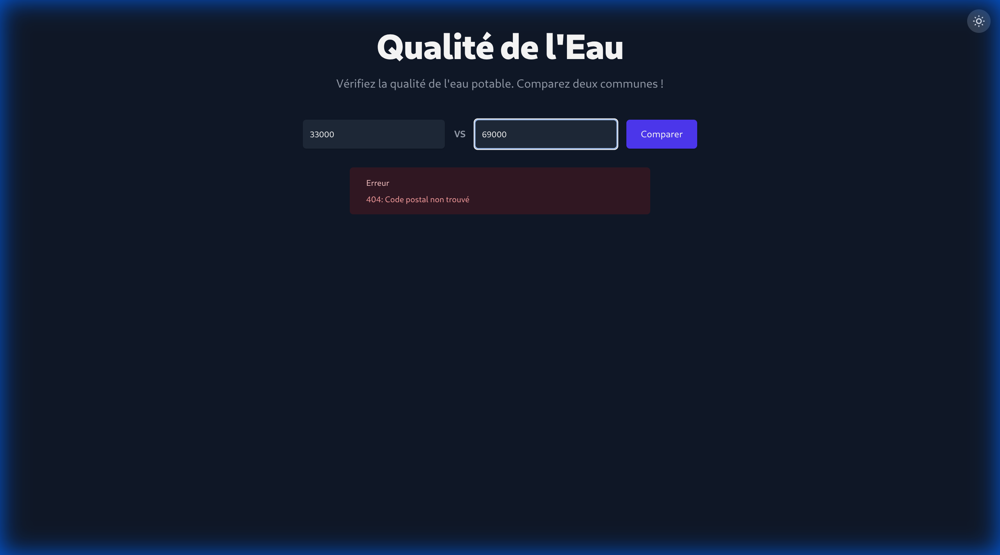
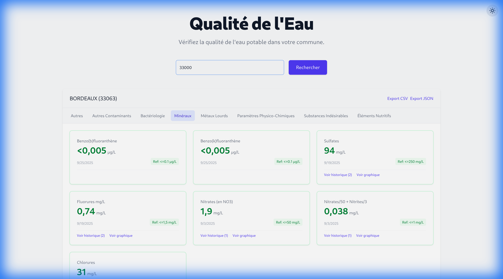

# Hub'Eau - Qualité de l'Eau en France

Une application web moderne et interactive pour visualiser la qualité de l'eau potable en France en temps réel, utilisant les données ouvertes de l'API Hub'Eau.



## Aperçu

Cette application permet aux citoyens français de consulter facilement les analyses de qualité de l'eau potable de leur commune. Elle offre une interface moderne, responsive et riche en fonctionnalités pour explorer ces données vitales.

### Fonctionnalités Clés

- **Carte Interactive** 🗺️ : Sélectionnez votre commune directement sur une carte de France.
- **Recherche par Code Postal** 📮 : Entrez simplement votre code postal pour accéder aux résultats.
- **Mode Comparaison** 🆚 : Comparez la qualité de l'eau de deux communes côte à côte.
- **Visualisation de Données** 📈 : Graphiques d'évolution pour les paramètres historiques.
- **Indicateurs de Conformité** ✅ : Bordures vertes/rouges pour identifier rapidement les problèmes.
- **Mode Sombre** 🌙 : Interface élégante et reposante pour les yeux (thème "Slate").
- **Pédagogie** 🎓 : Tooltips explicatifs pour comprendre les paramètres (Nitrates, pH, etc.).
- **Export de Données** 💾 : Téléchargez les résultats en CSV ou JSON.

## Screenshots

### Mode Comparaison
Comparez les résultats de deux villes (ex: Bordeaux vs Lyon).


### Mode Sombre et Tooltips
Une interface soignée avec des explications contextuelles.


## Technologies

Le projet a été modernisé avec une stack technique robuste :

- **Frontend** : React 18, Vite, TailwindCSS v4
- **Backend** : FastAPI (Python), Uvicorn
- **API** : Hub'Eau (données ouvertes)
- **Cartographie** : Leaflet, React-Leaflet, OpenStreetMap
- **Graphiques** : Recharts

## Installation

### Prérequis

- Node.js (v18+)
- Python 3.8+
- Git

### 1. Cloner le repository

```bash
git clone https://github.com/Kyworn/hubeau.git
cd hubeau
```

### 2. Backend (FastAPI)

```bash
# Créer un environnement virtuel
python -m venv venv
source venv/bin/activate  # Sur Windows: venv\Scripts\activate

# Installer les dépendances
pip install -r requirements.txt

# Lancer le serveur API (port 8001)
uvicorn api:app --reload --port 8001
```

### 3. Frontend (React)

Ouvrez un nouveau terminal :

```bash
cd frontend

# Installer les dépendances
npm install

# Lancer le serveur de développement (port 5173)
npm run dev
```

### 4. Accéder à l'application

Ouvrez votre navigateur sur [http://localhost:5173](http://localhost:5173).

## Structure du Projet

```
hubeau/
├── api.py                  # Application FastAPI
├── src/
│   └── main.py             # Script de récupération des données (API Hub'Eau)
├── frontend/               # Application React
│   ├── src/
│   │   ├── components/     # Composants (CommuneCard, HomeMap, etc.)
│   │   ├── App.jsx         # Composant principal
│   │   └── ...
│   └── ...
├── data/                   # Cache des données JSON
└── screenshots/            # Images pour le README
```

## Licence

Ce projet utilise des données publiques sous [Licence Ouverte etalab 2.0](https://www.etalab.gouv.fr/licence-ouverte-open-licence).
Code source sous licence MIT.

## Auteur

Développé par [Kyworn](https://github.com/Kyworn) avec l'assistance de **Antigravity** (Google).
