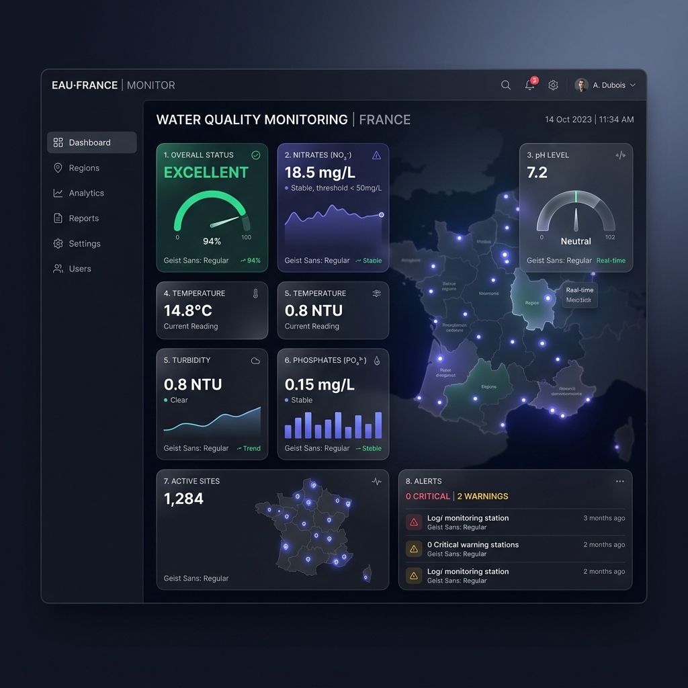

# Hub'Eau - Qualité de l'Eau en France (Reworked)

Une application web **premium** et **haute performance** pour visualiser la qualité de l'eau potable en France en temps réel, utilisant les données ouvertes de l'API Hub'Eau.



## ✨ Caractéristiques Clés

- **Interface Bento Grid** 🍱 : Visualisation moderne et structurée des paramètres de l'eau.
- **Glassmorphism Design** 💎 : Design épuré avec des effets de transparence et un mode sombre élégant.
- **Carte Interactive** 🗺️ : Sélection de commune par clic sur carte avec géocodage inverse.
- **Comparaison Avancée** 🆚 : Comparez les résultats de deux communes côte à côte avec des indicateurs de conformité clairs.
- **Visualisation de Données** 📈 : Graphiques d'évolution historique pour chaque paramètre (via Recharts).
- **Exports Multi-formats** 💾 : Téléchargement des rapports en **PDF**, **CSV** ou **JSON**.
- **Glossaire Pédagogique** 🎓 : Explications détaillées sur les substances analysées.

## 🛠️ Stack Technique

Le projet a été intégralement réécrit avec une stack de pointe :

- **Frontend** : [Next.js 15 (App Router)](https://nextjs.org/), [React 19](https://react.dev/)
- **Langage** : [TypeScript](https://www.typescriptlang.org/)
- **Styling** : [TailwindCSS v4](https://tailwindcss.com/)
- **Animations** : [Framer Motion](https://www.framer.com/motion/)
- **Data Fetching** : [TanStack Query v5](https://tanstack.com/query/latest)
- **Cartographie** : [Leaflet](https://leafletjs.com/) & [React-Leaflet](https://react-leaflet.js.org/)
- **Graphiques** : [Recharts](https://recharts.org/)
- **Génération PDF** : [jsPDF](https://github.com/parallax/jsPDF)

## 🚀 Installation

### Prérequis

- Node.js (v18+)
- npm ou pnpm

### 1. Cloner le repository

```bash
git clone https://github.com/Kyworn/hubeau.git
cd hubeau
```

### 2. Installer les dépendances

```bash
npm install
```

### 3. Lancer l'application

```bash
npm run dev
```

Ouvrez votre navigateur sur [http://localhost:3000](http://localhost:3000).

## 📄 Données

Ce projet utilise les données publiques de l'API Hub'Eau (Eau France) sous [Licence Ouverte etalab 2.0](https://www.etalab.gouv.fr/licence-ouverte-open-licence).

## 👨‍💻 Auteur

Développé avec passion par [Kyworn](https://github.com/Kyworn) et l'assistance de **Antigravity** (Google).
